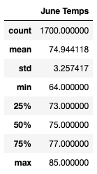
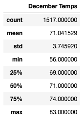
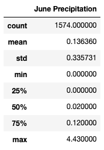
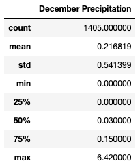

# Surfs Up

## Overview
A customer wants more information about temperature trends before opening a surf shop in Oahu, Hawaii. They need temperature data from Oahu, for June and December, in order to determine if the surf and ice cream shop business is sustainable year-round.

## Results
The analysis of the June and December data has provided some valuable insights that will help the customer make some crucial decisions. Here are three main points to highlight:
- June temperatures in Oahu average 74.94 degrees, with 64 degrees the lowest recorded temperature and 85 degrees the highest recorded temperature. The temperature ranged only 21 degrees, which is quite minimal. See *June Temps*, below.

    

- December temperatures in Oahu average 71.04 degrees, with 56 degrees the lowest recorded temperature and 83 degrees the highest recorded temperature. The temperature ranged 27 degrees, which is more than June, but still quite minimal. See *December Temps*, below.

    

- The differences between June and December temperatures are fairly small. A difference of about 4 degrees in average temperatures between the two months tells us that the temperature doesn't fluctuate much throughout the year.

## Summary
The consistent warm average temperatures and the small range in temperatures across months is ideal for setting up a year-round surf and ice cream shop business in Oahu. The following additional queries help to make the case even stronger, showing that average precipitation is fairly small and should not disrupt having a shop in Oahu:

- June precipitation in Oahu averages .14 inches, which appears to be favorable for setting up the shop, since many days have little or no precipitation. See *June Precipitation*, below.

    

- December precipitation in Oahu averages .22 inches, which also appears to be favorable for setting up the shop, since many days have little or no precipitation.  See *December Precipitation*, below.

    